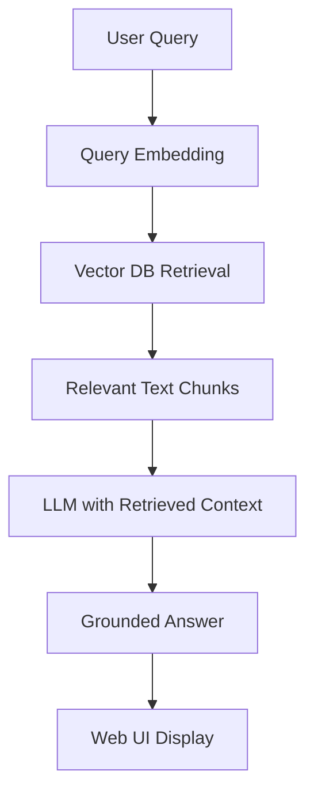

# RAG-based Interactive AI Assistant for the MS in Applied Data Science Program

This repository contains a **Retrieval-Augmented Generation (RAG)** based conversational AI assistant for the **Master of Science in Applied Data Science (MSCA)** program at the University of Chicago.

The system helps prospective students, current students, and alumni quickly find accurate information from the official program website by combining:

- Web scraping of the MSCA website  
- Text preprocessing and chunking  
- Embedding + vector database retrieval  
- Large Language Models (LLMs) for grounded answer generation  
- An interactive web UI for real-time Q&A  

> This project was developed as a course midterm project for a Generative AI / GenAI Principles class.

---

## 🌟 Project Motivation

The MSCA program webpage contains a large amount of information:

- Program overview and learning goals  
- Curriculum and course offerings  
- Faculty profiles and expertise  
- Admissions requirements  
- Career outcomes and resources  

However, this information is spread across multiple subpages. Users must manually browse, search, and scan long pages to find specific details such as:

- “What are the core courses in the program?”  
- “What are the admission requirements for international applicants?”  
- “What is the capstone project and how is it structured?”  

This project builds a **RAG-powered chatbot** that lets users ask these questions in natural language and receive **precise, contextualized answers** grounded in the official content of the MSCA website.

---

## 🎯 Scope & Objectives

### Goal

Build an end-to-end RAG system that:

1. Extracts and structures text data from the MSCA website  
2. Generates semantic embeddings and stores them in a vector database  
3. Retrieves relevant context for any user query  
4. Uses an LLM to generate **accurate, grounded** answers  
5. Exposes the system through an intuitive web-based chat interface  

### Objectives

- **Data** – Scrape and preprocess content from the official program website (overview, curriculum, faculty, admissions, careers).  
- **RAG** – Implement a Retrieval-Augmented Generation pipeline using embeddings + vector search.  
- **LLM** – Integrate with a Large Language Model (e.g., GPT-4, Llama, Mistral) for answer generation.  
- **UI** – Build a simple chat interface (Streamlit or Flask) for interactive Q&A.  
- **Evaluation** – Measure retrieval quality and response relevance using a small test set of questions.

---

## 🏗 System Architecture

At a high level, the system follows this flow:



### Components

- **Web Scraper** – Crawls the MSCA program website and collects raw HTML/text.  
- **Preprocessor** – Cleans HTML, normalizes text, segments and chunks content.  
- **Embedding Generator** – Uses a transformer-based model to generate dense vector embeddings for each chunk.  
- **Vector Store** – Stores embeddings and metadata to enable fast similarity search.  
- **RAG Pipeline** – Performs query embedding, top‑k retrieval, context assembly, and LLM prompting.  
- **LLM Interface** – Wraps calls to an external or local large language model.  
- **Web UI** – Provides a chat-style front‑end where users can ask questions and view answers.

---

## 🌐 Data Source & Web Scraping

**Knowledge base:** the official MS in Applied Data Science program website at the University of Chicago.

Typical scraping steps:

1. Identify the **main program URL** and discover all relevant sublinks:  
   - Program overview  
   - Curriculum / course descriptions  
   - Faculty pages  
   - Admissions information  
   - Career outcomes / resources  

2. Use `requests` and `BeautifulSoup` (or similar tools) to:  
   - Fetch HTML content  
   - Parse the DOM  
   - Extract the **main textual content** while ignoring navigation, sidebars, and footers  

3. Save the extracted text to `data/raw/` for further processing.

> Note: This project only uses **public, informational content** from the program website. It does not access any private or authenticated systems.

---

## 🧹 Preprocessing & Chunking

Once the raw text is collected, we perform:

1. **Cleaning**  
   - Strip HTML tags, scripts, and styles  
   - Normalize whitespace and unicode  
   - Remove repeated headers / footers  

2. **Segmentation**  
   - Split content by headings and paragraphs  
   - Preserve logical units (e.g., a full course description or admissions section)  

3. **Chunking**  
   - Break long sections into smaller chunks (e.g., 512–1024 tokens)  
   - Optionally use overlapping windows to preserve context  

4. **Metadata**  
   - Attach fields such as `source_url`, `section_title`, `page_type` (e.g., “Curriculum”, “Admissions”).

These processed chunks are stored in `data/processed/` and become the basis for embedding and retrieval.

---

## 🔢 Embeddings & Vector Store

To enable semantic search, we convert each chunk into a dense vector embedding.

Example setup (you can adjust to your own implementation):

- **Embedding model**:  
  - `sentence-transformers/all-MiniLM-L6-v2` or similar  
- **Vector store**:  
  - FAISS, Chroma, or Pinecone  

### Embedding pipeline

1. Load processed chunks from `data/processed/`.  
2. Use a sentence-transformer model to generate embeddings.  
3. Store embeddings, text, and metadata in a vector database (e.g., in `data/embeddings/`).

This allows us to retrieve the most relevant chunks for any query via nearest‑neighbor search.

---

## 🧠 RAG Pipeline

The Retrieval-Augmented Generation pipeline consists of:

1. **User Query Processing**  
   - Receive a natural language question from the web UI  
   - (Optional) Normalize or lightly clean the query  

2. **Query Embedding**  
   - Embed the query with the same model used for document chunks  

3. **Retrieval**  
   - Perform similarity search in the vector store  
   - Retrieve top‑k most relevant chunks and associated metadata  

4. **Context Assembly**  
   - Concatenate retrieved chunks into a prompt context  
   - Apply maximum token length limits and (optional) re-ranking  

5. **LLM Generation**  
   - Build a prompt that includes:  
     - System / instruction text  
     - Retrieved context  
     - User question  
   - Call the LLM (e.g., via an API) to generate an answer grounded in the context  

6. **Post‑processing**  
   - Optionally format the answer with bullet points or sections  
   - Optionally attach source information (e.g., page titles or URLs)  

---

## 🤖 LLM Integration & Agentic Patterns

The system can be integrated with:

- OpenAI GPT‑4  
- Llama-based models  
- Mistral or other compatible LLMs  

Using frameworks such as **LangChain** or **LlamaIndex**, we can:

- Wrap the LLM as a `llm` object or `ChatModel`  
- Implement a `RetrievalQA` chain or custom RAG chain  
- Experiment with **agentic patterns**, such as:
  - **ReAct (Reason + Act)** – where the model alternates between reasoning and tool use  
  - **Plan-and-execute** – planning multi‑step retrieval and answering strategies  
  - **Multi-agent collaboration** – e.g., separate retrieval and verification agents (optional)

---

## 💻 Web UI

The user interface can be built with **Streamlit** (recommended for course projects) or with Flask/FastAPI.

Typical UI features:

- Input box for user questions  
- “Send” button or enter‑to‑submit  
- Chat-style layout showing:
  - User messages  
  - Assistant responses  
- (Optional) Display of:
  - Retrieved context snippets  
  - URLs or section titles used as evidence  

Example Streamlit entry point (conceptual):

```python
import streamlit as st
from rag_pipeline import answer_question

st.title("MSCA Program RAG Assistant")

user_query = st.text_input("Ask a question about the MSCA program:")

if user_query:
    answer = answer_question(user_query)
    st.write("**Answer:**")
    st.write(answer)
```

---

## 📊 Evaluation

To understand how well the system works, we can evaluate:

- **Retrieval metrics**
  - Recall@k: whether relevant chunks are present in the top‑k retrieved  
  - Precision@k: proportion of retrieved chunks that are actually relevant  

- **Response metrics**
  - Relevance: does the answer directly address the user’s question?  
  - Faithfulness: is the answer grounded in the retrieved context, without hallucinations?  

- **User‑centric metrics**
  - Latency / response time  
  - Subjective user satisfaction (small‑scale user tests)  

---

## 📁 Repository Structure (Suggested)

Below is a suggested layout for this project:

```bash
.
├── data/
│   ├── raw/                 # Raw scraped HTML / text
│   ├── processed/           # Cleaned and chunked text
│   └── embeddings/          # Vector index and metadata
│
├── src/
│   ├── scraper.py           # Web scraping logic
│   ├── preprocess.py        # Cleaning, segmentation, chunking
│   ├── embed.py             # Embedding generation
│   ├── vector_store.py      # Vector DB setup / utils
│   ├── rag_pipeline.py      # Retrieval + generation pipeline
│   ├── llm_interface.py     # LLM API / local model wrapper
│   └── app.py               # Streamlit / Flask UI entry point
│
├── notebooks/
│   └── experiments.ipynb    # EDA & prototyping
│
├── docs/
│   ├── system_design.pdf    # Detailed (5+ page) design document
│   └── evaluation.md        # Evaluation details and results
│
├── requirements.txt
└── README.md                # This file
```

You can adapt the structure and file names to match your own implementation.

---

## ⚙️ Installation & Setup

1. **Clone the repository**

```bash
git clone https://github.com/<your-username>/<your-repo-name>.git
cd <your-repo-name>
```

2. **(Optional) Create a virtual environment**

```bash
python -m venv venv
source venv/bin/activate      # macOS / Linux
venv\Scripts\activate       # Windows
```

3. **Install dependencies**

`requirements.txt` may include (example):

```txt
beautifulsoup4
requests
sentence-transformers
langchain
faiss-cpu
chromadb
streamlit
python-dotenv
openai
```

Then run:

```bash
pip install -r requirements.txt
```

---

## ▶️ How to Run

1. **Run the scraper**

```bash
python src/scraper.py
```

2. **Preprocess & chunk the data**

```bash
python src/preprocess.py
```

3. **Generate embeddings & build the vector index**

```bash
python src/embed.py
```

4. **Launch the chatbot UI**

If using Streamlit:

```bash
streamlit run src/app.py
```

Open the shown URL (typically `http://localhost:8501`) in your browser and start asking questions about the MSCA program.

---

## 💬 Example Questions

- “What are the core courses in the MS in Applied Data Science program?”  
- “What are the admission requirements for applicants with a non‑CS background?”  
- “Is there a capstone project? What does it involve?”  
- “What kind of career support does the program provide?”  

The assistant responds with **summaries grounded in the official website content**, helping users quickly understand key information without manually browsing every page.

---

## 🛡 Responsible AI & Limitations

- The assistant is instructed to **only answer using information from its knowledge base** (scraped website).  
- When information is missing or ambiguous, it should respond with uncertainty instead of guessing.  
- Critical decisions (e.g., whether a student is eligible for admission) should always be confirmed via official university channels.  
- The system is a **course project / prototype**, not an official admissions tool.

---

## 🚀 Future Work

Potential extensions include:

- Automatic periodic re‑scraping and re‑indexing  
- Multi‑turn chat with conversation memory  
- Multi‑lingual support  
- More advanced agentic workflows (multi‑agent RAG, external tools)  
- Dockerization and cloud deployment (e.g., on GCP / AWS / Azure)  
- Integrating feedback loops to continually improve answer quality

---

## 📌 How to Mention This Project on Your Resume

Example bullet:

> Built an end‑to‑end Retrieval‑Augmented Generation chatbot that scraped the official MS in Applied Data Science program website, indexed content in a vector database, and integrated with a large language model and Streamlit UI to answer user questions with grounded, context‑aware responses.

You can then attach the GitHub repository link in your resume or LinkedIn profile.

---
